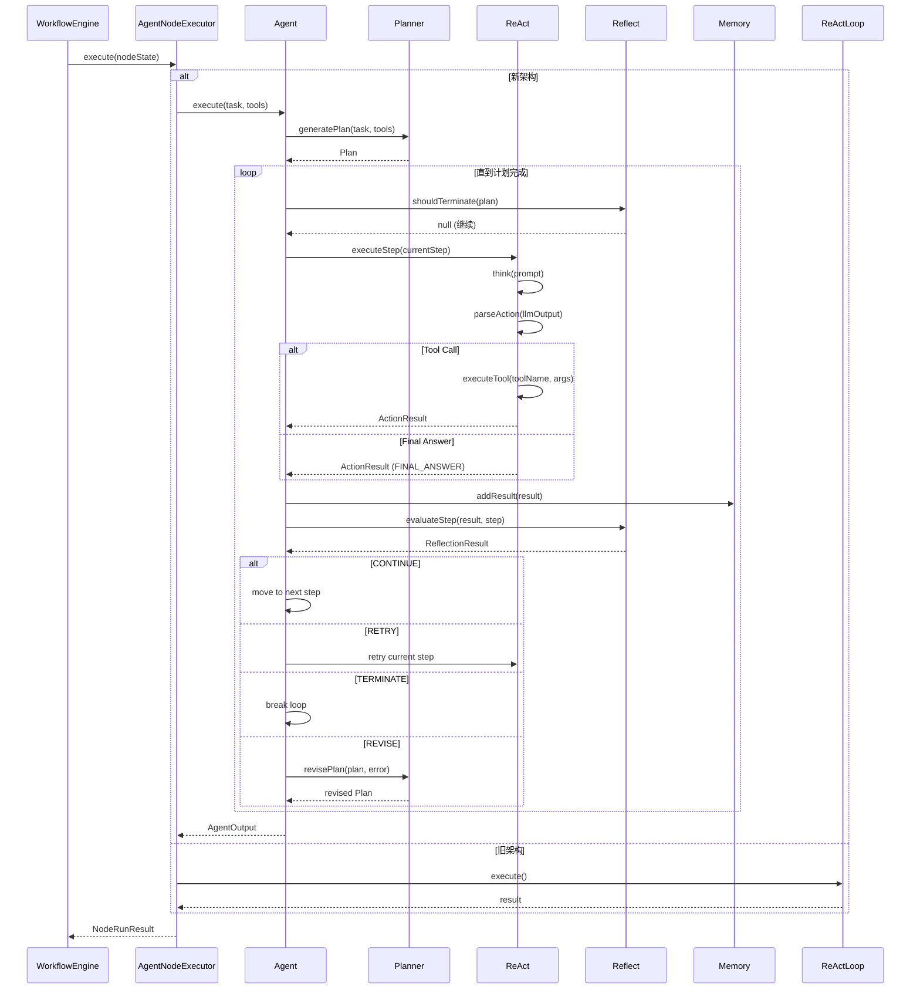
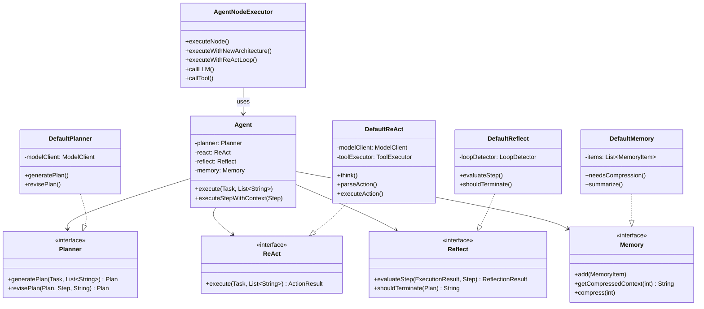

# Agent 节点架构与多 Agent 编排

## 1. 概述

AgentFlow 工作流引擎支持两种 Agent 执行架构：

| 架构 | 说明 | 默认 |
|------|------|------|
| **旧架构** | 基于 ReActLoop 的单循环推理 | 否 |
| **新架构** | Planner + ReAct + Reflect + Memory 组合 | 是 |

```
┌─────────────────────────────────────────────────────────────────┐
│                    Agent 节点执行架构                              │
├─────────────────────────────────────────────────────────────────┤
│                                                                  │
│  ┌──────────────┐                                               │
│  │ AgentNode    │  入口节点执行器                                 │
│  │ Executor     │  ┌─────────────────────────────────────────┐  │
│  └──────┬───────┘  │  useNewArchitecture == true?            │  │
│         │         │  ┌─────────────┐    ┌─────────────┐    │  │
│         │         │  │   新架构     │    │   旧架构      │    │  │
│         │         │  │ Agent       │    │ ReActLoop   │    │  │
│         │         │  │ +Planner   │    │ (单循环)    │    │  │
│         │         │  │ +ReAct     │    └─────────────┘    │  │
│         │         │  │ +Reflect   │                        │  │
│         │         │  │ +Memory    │                        │  │
│         │         │  └─────────────┘                        │  │
│         │         └─────────────────────────────────────────┘  │
│         │                                                       │
│         └─────────────────────────────────────────────────────►│
│                      输出结果 → VariablePool                     │
└─────────────────────────────────────────────────────────────────┘
```

---

## 2. 单 Agent 节点核心组件

### 2.1 AgentNodeExecutor (入口执行器)

**文件**: `workflow/src/main/java/com/iflytek/astron/workflow/engine/node/impl/agent/AgentNodeExecutor.java`

```java
@Slf4j
@Component
public class AgentNodeExecutor extends AbstractNodeExecutor {
    
    @Override
    protected NodeRunResult executeNode(NodeState nodeState, 
                                       Map<String, Object> inputs) throws Exception {
        Map<String, Object> nodeParam = nodeState.node().getData().getNodeParam();
        
        boolean useNewArchitecture = getBoolean(nodeParam, "useNewArchitecture", true);
        
        if (useNewArchitecture) {
            return executeWithNewArchitecture(nodeState, inputs, nodeParam);
        } else {
            return executeWithReActLoop(nodeState, inputs, nodeParam);
        }
    }
}
```

### 2.2 新架构组件协作关系

```
┌─────────────────────────────────────────────────────────────────┐
│                        Agent (主协调器)                           │
│  ┌───────────────────────────────────────────────────────────┐  │
│  │  1. Planner.generatePlan() → 生成执行计划                   │  │
│  │  2. while (!plan.isCompleted()) {                         │  │
│  │  │     a. Reflect.shouldTerminate() → 检查终止条件          │  │
│  │  │     b. ReAct.executeStep() → 执行当前步骤                 │  │
│  │  │     c. Memory.addResult() → 记录执行结果                 │  │
│  │  │     d. Reflect.evaluateStep() → 评估结果                 │  │
│  │  │     e. handleReflection() → 处理决策                     │  │
│  │  │     f. Memory.compress() if needed → 压缩记忆            │  │
│  │  │   }                                                    │  │
│  │  3. return AgentOutput                                     │  │
│  └───────────────────────────────────────────────────────────┘  │
└─────────────────────────────────────────────────────────────────┘
```

### 2.3 各组件职责

| 组件 | 接口 | 实现类 | 职责 |
|------|------|--------|------|
| **Planner** | `Planner.java` | `DefaultPlanner.java` | 生成/修正执行计划 |
| **ReAct** | `ReAct.java` | `DefaultReAct.java` | 单步执行 + LLM 推理 |
| **Reflect** | `Reflect.java` | `DefaultReflect.java` | 结果评估 + 循环检测 |
| **Memory** | `Memory.java` | `DefaultMemory.java` | 记忆管理与上下文压缩 |

---

## 3. ReAct 循环机制

### 3.1 核心循环

```java
// DefaultReAct.java
public ActionResult execute(Task task, List<String> availableTools) {
    while (!isTerminal && iteration < maxIterations) {
        // 1. Think - LLM 推理
        String thought = llm.think(prompt);
        
        // 2. Parse - 解析动作用
        Action action = parseAction(thought);
        
        // 3. Act - 执行动作
        ActionResult result = executeAction(action);
        
        // 4. Observe - 观察结果
        observation = result.getOutput();
        
        // 5. 记录记忆
        memory.add(thought, action, observation);
    }
}
```

### 3.2 动作类型

```java
public enum ActionType {
    FINAL_ANSWER,  // 任务完成
    TOOL_CALL,      // 工具调用
    REASONING,      // 继续推理
    ERROR           // 执行错误
}
```

### 3.3 决策流程

```
LLM 输出
    │
    ├── 包含 <final_answer> ──→ 返回答案，任务完成 ✓
    │
    ├── 包含 <tool_call> ────→ 执行工具
    │                              │
    │                              ├── 成功 → 记录结果，继续循环
    │                              │
    │                              └── 失败 → Reflect 评估
    │                                      │
    │                                      ├── CONTINUE → 下一步
    │                                      ├── RETRY → 重试
    │                                      └── TERMINATE → 终止
    │
    └── 其他输出 ─────────────────→ 继续推理
```

---

## 4. Planner (计划生成)

### 4.1 接口定义

```java
public interface Planner {
    Plan generatePlan(Task task, List<String> availableTools);
    Plan revisePlan(Plan currentPlan, Step failedStep, String errorReason);
    boolean assessPlanViability(Plan plan);
    String getPlanSummary(Plan plan);
}
```

### 4.2 计划结构

```java
@Data
public class Plan {
    private String planId;
    private String taskDescription;
    private List<Step> steps;        // 有序步骤列表
    private int currentStepIndex;    // 当前步骤索引
    private PlanStatus status;       // PENDING / IN_PROGRESS / COMPLETED / FAILED
    private String failureReason;
}

@Data
public class Step {
    private int order;              // 步骤序号
    private String description;      // 步骤描述
    private String toolName;         // 工具名称
    private String goal;            // 步骤目标
    private Map<String, Object> params;  // 工具参数
    private StepStatus status;      // PENDING / RUNNING / COMPLETED / FAILED
}
```

### 4.3 计划生成流程

```
输入: Task + AvailableTools
       │
       ▼
┌─────────────────┐
│ 构建 Planning   │  - 任务描述
│ Prompt         │  - 目标列表
└────────┬────────┘  - 可用工具
         │
         ▼
┌─────────────────┐
│ 调用 LLM       │  ModelClient (prompt → JSON)
└────────┬────────┘
         │
         ▼
┌─────────────────┐
│ 解析 Plan JSON  │  - 提取 steps[]
└────────┬────────┘
         │
         ▼
    返回 Plan 对象
```

---

## 5. Reflect (结果评估)

### 5.1 接口定义

```java
public interface Reflect {
    ReflectionResult evaluateStep(ExecutionResult result, Step step);
    boolean needRevise(Plan plan);
    String shouldTerminate(Plan plan);  // null = 继续, 非null = 终止原因
    boolean detectLoop(List<ExecutionResult> executionHistory);
}
```

### 5.2 反射决策

```java
public enum NextAction {
    CONTINUE,   // 步骤成功，继续下一步
    RETRY,      // 可重试错误，重试当前步骤
    REVISE,     // 需要修正计划
    TERMINATE,  // 不可恢复错误，终止
    COMPLETED   // 计划完成
}
```

### 5.3 循环检测

```java
// DefaultReflect.LoopDetector
public boolean isLooping(List<Step> steps) {
    // 检查最近几个步骤的输出是否重复
    for (String output : recentOutputs) {
        int freq = outputCounts.getOrDefault(output, 0) + 1;
        if (freq >= threshold) {  // threshold = 3
            log.warn("检测到循环: '{}' 重复 {} 次", output, freq);
            return true;
        }
    }
    return false;
}
```

---

## 6. Memory (记忆管理)

### 6.1 接口定义

```java
public interface Memory {
    void add(MemoryItem item);
    void addResult(ExecutionResult result);
    List<MemoryItem> getAll();
    String getCompressedContext(int maxTokens);
    List<MemoryItem> getRecent(int count);
    boolean needsCompression(int maxTokens);
    void compress(int targetTokens);
}
```

### 6.2 记忆类型

```java
public enum MemoryType {
    reasoning,     // LLM 推理内容 (可压缩)
    tool_call,     // 工具调用记录
    observation,   // 工具执行结果 (可压缩)
    result,        // 最终结果 (关键记忆，保留)
    final_answer,  // 最终答案 (关键记忆，保留)
    error          // 错误信息
}
```

### 6.3 上下文压缩策略

```
内存状态
   │
   ├── 关键记忆 (result, final_answer)
   │     └── 直接保留，不压缩
   │
   └── 非关键记忆 (reasoning, observation)
         └── 超过阈值时触发压缩
               │
               ▼
         ┌─────────────────┐
         │  Summarize      │  - 旧记忆 → LLM 摘要
         │  (LLM 调用)     │  - 生成 summary 记忆项
         └────────┬────────┘
                  │
                  ▼
            压缩后的记忆列表
```

---

## 7. 多 Agent 通信机制

### 7.1 架构概览

```
┌─────────────────────────────────────────────────────────────────┐
│                    多 Agent 协作架构                              │
├─────────────────────────────────────────────────────────────────┤
│                                                                  │
│  ┌─────────┐      ┌─────────┐      ┌─────────┐                │
│  │ Agent A │      │ Agent B │      │ Agent C │                │
│  │ (InBox) │      │ (InBox) │      │ (InBox) │                │
│  └───┬─────┘      └───┬─────┘      └───┬─────┘                │
│      │                │                │                         │
│      └────────────────┴────────────────┘                         │
│                       │                                          │
│              ┌────────▼────────┐                               │
│              │  MessageRouter   │  消息路由                      │
│              └────────┬────────┘                               │
│                       │                                          │
│     ┌─────────────────┼─────────────────┐                        │
│     ▼                 ▼                 ▼                        │
│ ┌────────┐      ┌──────────┐      ┌────────────┐              │
│ │ Agent  │      │ Shared   │      │  Agent     │              │
│ │Registry│      │Blackboard│      │  Barrier   │              │
│ │(注册)  │      │(共享知识) │      │  (同步)     │              │
│ └────────┘      └──────────┘      └────────────┘              │
│                                                                  │
└─────────────────────────────────────────────────────────────────┘
```

### 7.2 核心组件

| 组件 | 文件 | 职责 |
|------|------|------|
| **AgentCommunicationService** | `agent/service/` | 通信服务接口 |
| **AgentMessage** | `agent/components/` | 消息结构定义 |
| **AgentRegistry** | `agent/components/` | Agent 注册与发现 |
| **MessageRouter** | `agent/components/` | 消息路由转发 |
| **SharedBlackboard** | `agent/components/` | 共享知识库 |
| **AgentBarrier** | `agent/components/` | 同步屏障 |
| **InBox** | `agent/components/` | Per-Agent 消息队列 |

### 7.3 消息类型

```java
public enum MessageType {
    REQUEST,     // 请求消息，需要响应
    RESPONSE,    // 响应消息
    BROADCAST,   // 广播消息
    NOTIFY,      // 通知消息
    QUERY,       // 查询消息
    UPDATE       // 更新消息
}
```

### 7.4 消息结构

```java
@Data
public class AgentMessage {
    private String messageId;           // 消息唯一ID
    private String senderId;             // 发送者ID
    private String senderRole;          // 发送者角色
    private String targetId;            // 目标Agent ID
    private MessageType messageType;   // 消息类型
    private Object content;             // 消息内容
    private Map<String, Object> metadata; // 元数据
    private String relatedRequestId;    // 关联请求ID (用于响应)
    private String workflowId;          // 工作流上下文
    private long timestamp;            // 时间戳
    
    // 工厂方法
    public static AgentMessage createRequest(...) {}
    public static AgentMessage createResponse(...) {}
    public static AgentMessage createBroadcast(...) {}
}
```

---

## 8. AgentRegistry (注册中心)

```java
@Service
public class AgentRegistry {
    
    private final Map<String, AgentInfo> agents = new ConcurrentHashMap<>();
    
    // 注册 Agent
    public void register(AgentInfo agentInfo) {
        agents.put(agentInfo.getAgentId(), agentInfo);
    }
    
    // 获取 Agent
    public AgentInfo getAgent(String agentId) {
        return agents.get(agentId);
    }
    
    // 按角色查找
    public List<AgentInfo> findByRole(String role) {
        return agents.values().stream()
            .filter(a -> role.equals(a.getRole()))
            .collect(Collectors.toList());
    }
    
    // 按能力查找
    public List<AgentInfo> findByCapability(String capability) {
        return agents.values().stream()
            .filter(a -> a.getCapabilities().contains(capability))
            .collect(Collectors.toList());
    }
}
```

---

## 9. SharedBlackboard (共享知识库)

```java
@Service
public class SharedBlackboard {
    
    private final Map<String, KnowledgeEntry> knowledge = new ConcurrentHashMap<>();
    
    // 写入知识
    public void write(String key, Object value, String tags) {
        knowledge.put(key, new KnowledgeEntry(key, value, tags, System.currentTimeMillis()));
    }
    
    // 读取知识
    public Object read(String key) {
        KnowledgeEntry entry = knowledge.get(key);
        return entry != null ? entry.getValue() : null;
    }
    
    // 按标签查询
    public List<KnowledgeEntry> queryByTags(String tagPattern) {
        return knowledge.values().stream()
            .filter(e -> e.getTags().matches(tagPattern))
            .collect(Collectors.toList());
    }
    
    // 订阅变更
    public void subscribe(String pattern, String consumerId, Consumer<KnowledgeEntry> callback) {
        // 模式匹配订阅
    }
}
```

---

## 10. AgentBarrier (同步屏障)

```java
public class AgentBarrier {
    
    private final String barrierId;
    private final int requiredCount;
    private final Set<String> arrivedAgents = new ConcurrentHashSet<>();
    private final CountDownLatch latch;
    
    // Agent 到达
    public void arrive(String agentId) {
        arrivedAgents.add(agentId);
        latch.countDown();
    }
    
    // 等待所有 Agent 到达
    public boolean await(long timeout, TimeUnit unit) throws InterruptedException {
        return latch.await(timeout, unit);
    }
    
    // 检查是否已触发
    public boolean isTriggered() {
        return latch.getCount() == 0;
    }
}
```

---

## 11. DSL 配置示例

### 11.1 单 Agent 节点配置

```json
{
  "id": "agent-node-001",
  "data": {
    "nodeMeta": {
      "nodeType": "AGENT",
      "aliasName": "客服 Agent"
    },
    "nodeParam": {
      "useNewArchitecture": true,
      "modelId": "qwen-plus",
      "temperature": 0.7,
      "taskPrompt": "你是一个智能客服，请回答用户的问题",
      "taskGoal": "解决用户问题",
      "maxContextTokens": 8000,
      "maxSteps": 20,
      "availableTools": ["weather-tool", "faq-tool"]
    },
    "inputs": [
      {
        "name": "userQuery",
        "schema": {
          "value": {
            "isReference": true,
            "content": {
              "nodeId": "start::001",
              "name": "user_input"
            }
          }
        }
      }
    ],
    "outputs": [
      {"name": "answer"},
      {"name": "reasoning"}
    ]
  }
}
```

### 11.2 多 Agent 协作配置

```json
{
  "nodes": [
    {
      "id": "coordinator-agent",
      "type": "AGENT",
      "data": {
        "nodeParam": {
          "useNewArchitecture": true,
          "modelId": "qwen-plus",
          "taskPrompt": "你是一个协调者，负责分配任务给下属 Agent"
        }
      }
    },
    {
      "id": "research-agent",
      "type": "AGENT", 
      "data": {
        "nodeParam": {
          "useNewArchitecture": true,
          "modelId": "qwen-plus",
          "taskPrompt": "你是一个研究助手，负责搜索和分析信息"
        }
      }
    },
    {
      "id": "writer-agent",
      "type": "AGENT",
      "data": {
        "nodeParam": {
          "useNewArchitecture": true,
          "modelId": "qwen-plus",
          "taskPrompt": "你是一个写作助手，负责整理和输出"
        }
      }
    }
  ],
  "edges": [
    {"source": "start::001", "target": "coordinator-agent"},
    {"source": "coordinator-agent", "target": "research-agent"},
    {"source": "coordinator-agent", "target": "writer-agent"},
    {"source": "research-agent", "target": "writer-agent"},
    {"source": "writer-agent", "target": "end::001"}
  ]
}
```

### 11.3 Agent 间消息传递

```java
// 发送消息给指定 Agent
agentCommService.sendMessage(
    AgentMessage.createRequest(
        "coordinator-agent",
        "research-agent", 
        MessageType.QUERY,
        "请搜索关于 {topic} 的信息",
        workflowId
    )
);

// 广播消息给所有 Agent
agentCommService.broadcastMessage(
    AgentMessage.createBroadcast(
        "coordinator-agent",
        MessageType.NOTIFY,
        "任务开始，请准备",
        workflowId
    )
);

// 写入共享知识库
agentCommService.writeToBlackboard(
    "research-results",
    searchResults,
    "research,topic={topic}"
);

// 读取共享知识库
Object results = agentCommService.readFromBlackboard("research-results");
```

---

## 12. 执行流程时序图



---

## 13. 类关系图



---

## 14. 文件索引

| 组件 | 文件路径 |
|------|----------|
| **AgentNodeExecutor** | `workflow/src/main/java/com/iflytek/astron/workflow/engine/node/impl/agent/AgentNodeExecutor.java` |
| **Agent** | `workflow/src/main/java/com/iflytek/astron/workflow/engine/node/impl/agent/Agent.java` |
| **ReAct** | `workflow/src/main/java/com/iflytek/astron/workflow/engine/node/impl/agent/ReActLoop.java` |
| **Planner** | `workflow/src/main/java/com/iflytek/astron/workflow/engine/node/impl/agent/core/Planner.java` |
| **DefaultPlanner** | `workflow/src/main/java/com/iflytek/astron/workflow/engine/node/impl/agent/impl/DefaultPlanner.java` |
| **Reflect** | `workflow/src/main/java/com/iflytek/astron/workflow/engine/node/impl/agent/core/Reflect.java` |
| **DefaultReflect** | `workflow/src/main/java/com/iflytek/astron/workflow/engine/node/impl/agent/impl/DefaultReflect.java` |
| **Memory** | `workflow/src/main/java/com/iflytek/astron/workflow/engine/node/impl/agent/core/Memory.java` |
| **DefaultMemory** | `workflow/src/main/java/com/iflytek/astron/workflow/engine/node/impl/agent/impl/DefaultMemory.java` |
| **AgentCommunicationService** | `workflow/src/main/java/com/iflytek/astron/workflow/agent/service/AgentCommunicationService.java` |
| **AgentCommunicationServiceImpl** | `workflow/src/main/java/com/iflytek/astron/workflow/agent/service/AgentCommunicationServiceImpl.java` |
| **AgentMessage** | `workflow/src/main/java/com/iflytek/astron/workflow/agent/components/AgentMessage.java` |
| **AgentRegistry** | `workflow/src/main/java/com/iflytek/astron/workflow/agent/components/AgentRegistry.java` |
| **SharedBlackboard** | `workflow/src/main/java/com/iflytek/astron/workflow/agent/components/SharedBlackboard.java` |
| **MessageRouter** | `workflow/src/main/java/com/iflytek/astron/workflow/agent/components/MessageRouter.java` |
| **AgentBarrier** | `workflow/src/main/java/com/iflytek/astron/workflow/agent/components/AgentBarrier.java` |
| **InBox** | `workflow/src/main/java/com/iflytek/astron/workflow/agent/components/InBox.java` |
| **AgentInfo** | `workflow/src/main/java/com/iflytek/astron/workflow/agent/components/AgentInfo.java` |

---

## 15. 与 Dify/Coze 对比

| 维度 | AgentFlow | Dify | Coze |
|------|-----------|------|------|
| **单 Agent 架构** | ReAct + 规划/反思 | LLM 节点 + 工具链 | Bot + 插件 |
| **多 Agent 协作** | MessageRouter + Blackboard | 工作流嵌套 | Bot 调用 Bot |
| **消息机制** | AgentMessage + InBox | 无原生支持 | 无原生支持 |
| **共享知识** | SharedBlackboard | 知识库节点 | 知识库关联 |
| **同步机制** | AgentBarrier | 无 | 无 |
| **规划能力** | Planner 生成/修正计划 | 无 | 无 |
| **反思能力** | Reflect 评估 + 循环检测 | 无 | 无 |

---

## 16. 待完善功能

| 功能 | 状态 | 说明 |
|------|------|------|
| Agent 生命周期管理 | 已实现 | 基本框架 |
| 消息持久化 | 已设计 | 数据库表已设计 |
| Agent 能力发现 | 已实现 | AgentRegistry |
| 多 Agent 并行执行 | 规划中 | 需要 ParallelWorkflowEngine 集成 |
| Agent 模板市场 | 规划中 | 复用 Agent 配置 |
